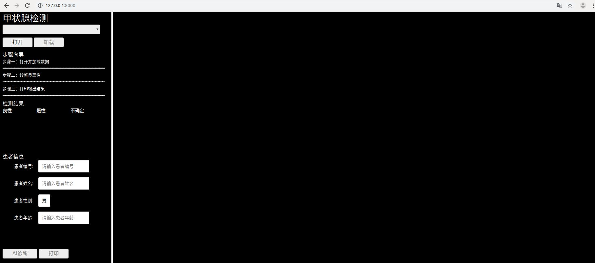
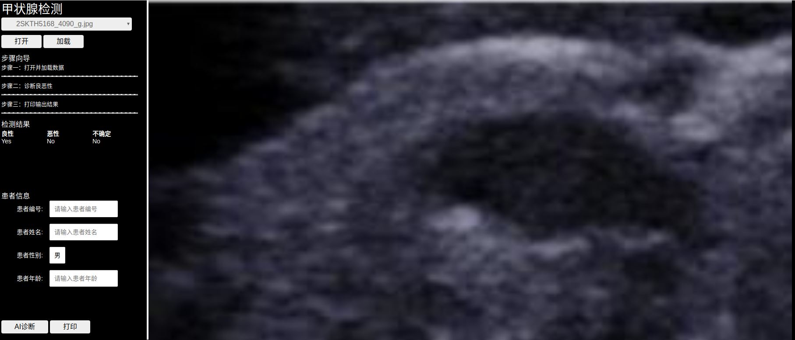
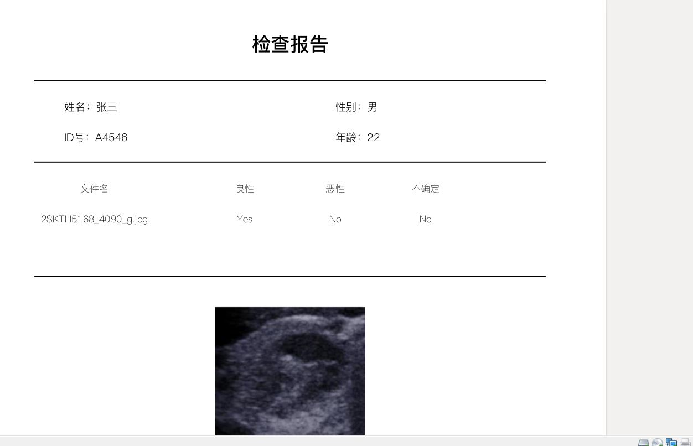

# iLab-nodules

### 项目简介
基于python2.7 Django开发的甲状腺肿瘤检测网站，用户输入裁剪好的肿瘤图片文件，系统将自动检测该肿瘤良恶性的倾向并生成检测报告。

### 项目环境

- Python2.7
- Django 1.11.6
- SimpleITK-1.1.0(可能需要翻墙) 
- Scipy-1.1.0
- Pillow-5.2.0
- numpy-1.15.0
- reportlab-3.5.23
- joblib-0.12.2
- tensorflow-1.3.0
- setuptools-0.6rc11
- 测试平台：Ubuntu 16.04
- 测试浏览器：Chrome
- 建议内存>=8GB

### 项目运行
- 将checkpoint hard.ckpt.data-00000-of-00001 hard.ckpt.index hard.ckpt.meta 放在/data/last/model路径下
- 将checkpoint san.ckpt.data-00000-of-00001 san.ckpt.index san.ckpt.meta 放在/data/san/model路径下
- 项目根目录下用命令行执行python manage.py runserver
- 根据给出的地址（本机为127.0.0.1:8000）使用chrome浏览器访问

### 项目目录结构

```

│  db.sqlite3
│  manage.py
│  readme.md   
├─data
│  │  .DS_Store
│  │  
│  ├─last
│  │  └─model
│  └─san
│      └─model
├─iLabNodules
│  │  .DS_Store
│  │  settings.py
│  │  settings.pyc
│  │  urls.py
│  │  urls.pyc
│  │  views.py
│  │  views.pyc
│  │  wsgi.py
│  │  wsgi.pyc
│  │  __init__.py
│  │  __init__.pyc
│  │  
│  ├─data_proc
│  │      .DS_Store
│  │      ajax_test.py
│  │      ajax_test.pyc
│  │      img_proc.py
│  │      img_proc.pyc
│  │      load.py
│  │      load.pyc
│  │      thyroid_detection.py
│  │      thyroid_detection.pyc
│  │      upload.py
│  │      upload.pyc
│  │      vgg16.py
│  │      vgg16.pyc
│  │      vgg2.py
│  │      vgg2.pyc
│  │      __init__.py
│  │      __init__.pyc
│  │      
│          
└─index
    │  .DS_Store
    │  admin.py
    │  admin.pyc
    │  apps.py
    │  models.py
    │  models.pyc
    │  tests.py
    │  views.py
    │  __init__.py
    │  __init__.pyc
    │  
    ├─migrations
    │      .DS_Store
    │      __init__.py
    │      __init__.pyc
    │      
    ├─static
    │  │  .DS_Store
    │  │  PingFang-SC-Regular.ttf
    │  │  
    │  ├─bootstrap
    │  │          
    │  ├─CSS
    │  │      buttons.css
    │  │      cornerstone.min.css
    │  │      home_right.css
    │  │      index.css
    │  │      
    │  ├─font
    │  │      
    │  ├─image
    │  │      .DS_Store
    │  │      
    │  ├─imageLoader
    │  │      cornerstoneWADOImageLoader.js
    │  │      cornerstoneWADOImageLoader.min.js
    │  │      cornerstoneWADOImageLoaderCodecs.js
    │  │      cornerstoneWADOImageLoaderCodecs.min.js
    │  │      cornerstoneWADOImageLoaderWebWorker.js
    │  │      cornerstoneWADOImageLoaderWebWorker.min.js
    │  │      
    │  ├─js
    │  │      cornerstone.min.js
    │  │      cornerstoneMath.min.js
    │  │      cornerstoneTools.min.js
    │  │      dicomParser.min.js
    │  │      uids.js
    │  │      
    │  ├─layer
    │  │  │  layer.js
    │  │  │  
    │  │  ├─mobile
    │  │  │  │  layer.js
    │  │  │  │  
    │  │  │  └─need
    │  │  │          layer.css
    │  │  │          
    │  │  └─theme
    │  │      └─default
    │  │              
    │  └─layui
    │                  
    ├─templates
    │  │  index.html
    │  │  result.html
    │  │  
    │  ├─footer
    │  │      footer.html
    │  │      
    │  └─header
    │          header.html
```


### 项目使用

- 在浏览器中运行成功后将出现如下页面

  

- 点击打开，选择相应的文件（只支持jpg bmp png等图片格式的文件），点击加载，图片就会在右侧黑色区域显示

- 点击左下角AI诊断，等待1-5s，检测结果将会显示在左侧中间区域

  

- 输入患者信息，点击打印，将自动下载PDF格式的检查报告

  

### 联系方式

- 17717084193@163.com

